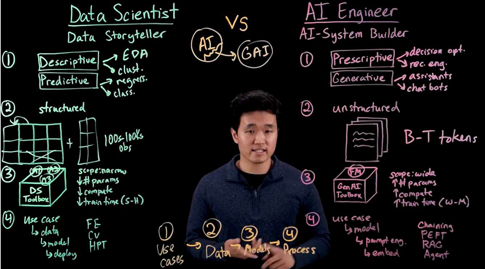

AI:
- computer vision
- natural language processing
- generative AI
- machine learning
- deep learning

Machine learning techniques:
- Classification: predict class or category
- Regression
- Clustering
- Association
- Anomaly detection
- Sequence mining
- Dimension reduction
- Recommendation systems

Lifecycle of a machine learning model:
- problem definition
- data collection
- data preparation
- model development and evaluation
- model deployment

ETL: Extract, Transform, Load

- Content-based filtering
- Collaborative filtering

Languages:
Python, R, Julia, Scala, Java, JavaScript

Data processing:
PostgreSQL, Hadoop, Spark, Apache Kafka, Pandas, NumPy

Data visualization:
Matplotlib, Seaborn, ggplot2, Tableau

ML ecosystem:
NumPy, Pandas, SciPy, Scikit-learn

Deep learning:
TensorFlow, Keras, Theano, PyTorch

Computer vision:
OpenCV, Scikit-image, TorchVision

NLP:
NLTK, TextBlob, Stanza

Generative AI:
Hugging face transformers, ChatGPT, DALL-E, PyTorch

